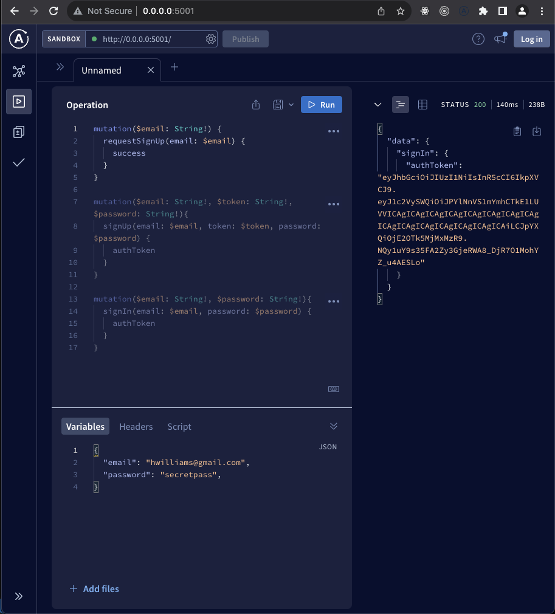
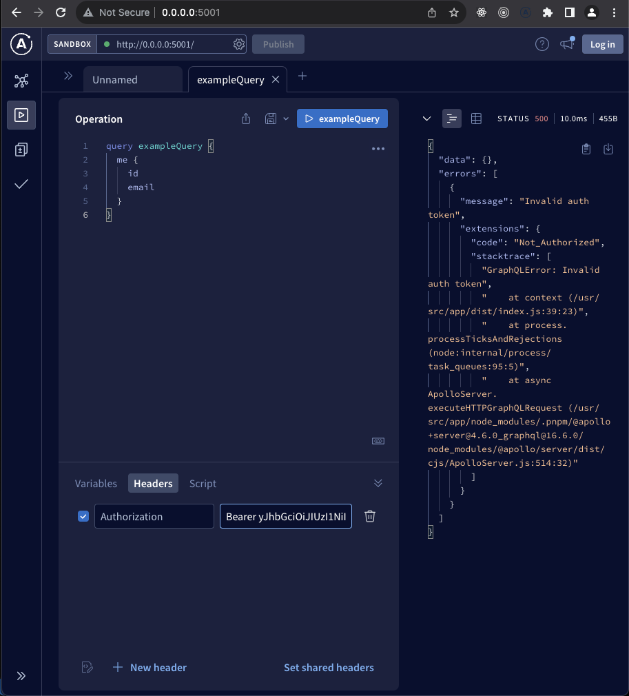

### graphql-auth

An app to showcase authentication using graphQL.
`nodejs` backend and `postgres` are running as docker containers.
It is backend only app but can be integrated with any flavour of frontend.

#### tech stack involved

- `prisma` for ORM
- `knex` for data migrations
- `typescript`
- `pnpm` pkg manager
- `graphQL`

#### Queries

#### Token invalidation

